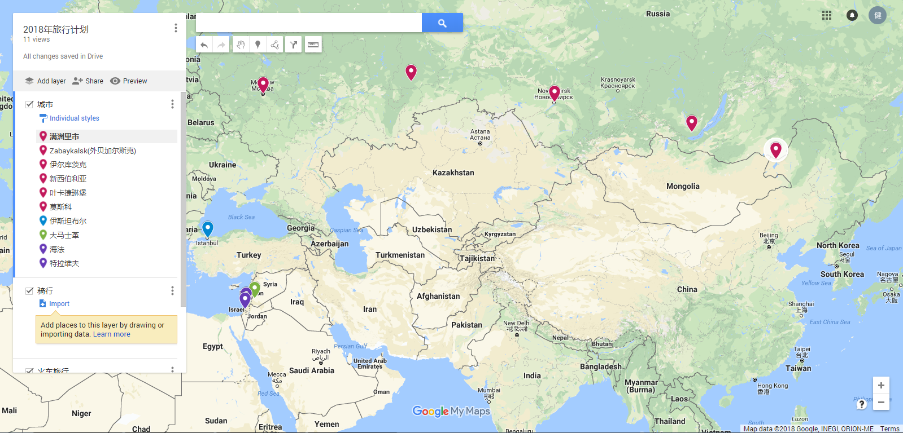

## 前言:
每个人都具有思维的局限性，而突破思维的局限性最好的方式就是watching

* Do not remove this line (it will not be displayed)
{:toc}

## 简介
这次路程主要路线是俄罗斯-土耳其-叙利亚-以色列，是第一次国外旅行，我将其命名为`w旅行`。希望能够
通过这次旅行重塑整体的世界观。w旅行时间跨度在4个月到3年之间，具体会按照我遇到什么进行安排，而此次
的目的包括两点：

  1. 获取物质上的自由，寻找自己的财富增长点
  2. 获取精神上的自由，包括观点的完整性，这就必须让我解决外语问题，使我能够获取更为完整的信息

## 行走路线

## 行走计划
## 经济情况
## 学习内容
